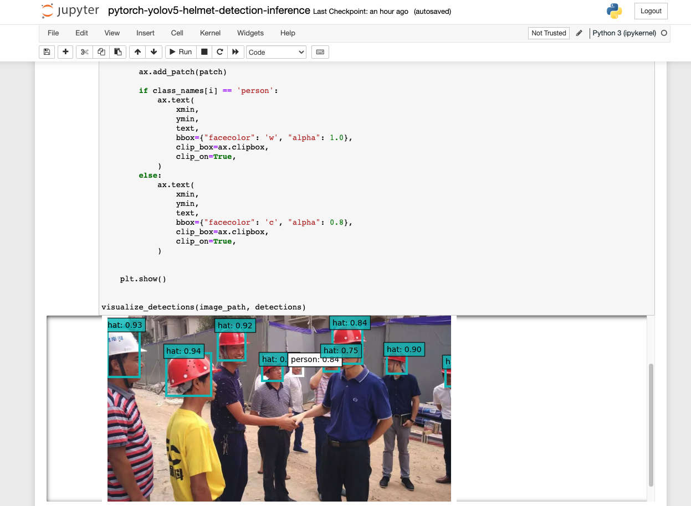

## Helmet Detection Deployment on Single Node

#### Prerequisites

- [Python3 and pip3](https://docs.python-guide.org/starting/install3/linux/) 

```bash
# check the python version
$ python3 --version
# if not, install as following
$ sudo apt update
$ sudo apt -y upgrade
$ sudo apt install python3.8
$ sudo apt install python3-pip
$ python3 --version
```

- Docker:  Docker Engine comes bundled with Docker Desktop for Linux, this is the easiest and quickest way to get started. If not, you could follow the [detailed installation guide](https://docs.docker.com/engine/install/ubuntu/)


#### Installation with Docker

```bash
$ git clone https://github.com/harperjuanl/helmet_yolov5_torchserve.git
$ cd helmet_yolov5_torchserve
# if you can not clone, you can also download from this link https://github.com/harperjuanl/helmet_yolov5_torchserve/archive/refs/heads/main.zip, and extract the zip file

$ docker build . -t helmet_yolov5_torchserve:v1
$ docker run -p 8080:8080 -p 8081:8081 helmet_yolov5_torchserve:v1

# Register model
$ curl -X POST  "http://localhost:8081/models?url=./model_store/helmet_detection.mar&model_name=helmet_detection"
$ curl -X PUT "http://0.0.0.0:8081/models/helmet_detection?min_worker=3"
```

#### Installation without Docker

```bash
$ sudo apt-get install openjdk-11-jdk
$ git clone https://github.com/harperjuanl/helmet_yolov5_torchserve.git
$ cd helmet_yolov5_torchserve/resource/helmet_yolov5

$ pip3 install -r requirements.txt -i https://mirrors.aliyun.com/pypi/simple/
$ python3-pip install torchserve
$ cd .. 
$ torchserve --start --ncs --model-store model_store --models helmet_detection.mar

# Register model
$ curl -X POST  "http://localhost:8081/models?url=./model_store/helmet_detection.mar&model_name=helmet_detection"
$ curl -X PUT "http://0.0.0.0:8081/models/helmet_detection?min_worker=3"
```

#### Detection & Result

```bash
# Detect in the ternimal
$ curl -T test_1.jpg 'http://localhost:8080/predictions/helmet_detection' 
Output: 
[
  {
    "x1": 0.16830310225486755,
    "y1": 0.36698096990585327,
    "x2": 0.3356267809867859,
    "y2": 0.5662754774093628,
    "confidence": 0.9418923854827881,
    "class": "person"
  },
  {
    "x1": -0.0003846943436656147,
    "y1": 0.2697369456291199,
    "x2": 0.11975767463445663,
    "y2": 0.5021408796310425,
    "confidence": 0.9287041425704956,
    "class": "person"
  },
  {
    "x1": 0.31550225615501404,
    "y1": 0.27130556106567383,
    "x2": 0.4195330739021301,
    "y2": 0.4244980812072754,
    "confidence": 0.9224411249160767,
    "class": "person"
  },
  {
    "x1": 0.8000054359436035,
    "y1": 0.36035841703414917,
    "x2": 0.8742903470993042,
    "y2": 0.4628569483757019,
    "confidence": 0.9012498259544373,
    "class": "person"
  },
  {
    "x1": 0.44192060828208923,
    "y1": 0.3977605700492859,
    "x2": 0.5190550088882446,
    "y2": 0.4892307221889496,
    "confidence": 0.8915991187095642,
    "class": "person"
  },
  {
    "x1": 0.9677120447158813,
    "y1": 0.4071219563484192,
    "x2": 0.9998529553413391,
    "y2": 0.5111279487609863,
    "confidence": 0.875587522983551,
    "class": "person"
  },
  {
    "x1": 0.5246236324310303,
    "y1": 0.39841872453689575,
    "x2": 0.5718141794204712,
    "y2": 0.4656790792942047,
    "confidence": 0.8437989950180054,
    "class": "hat"
  },
  {
    "x1": 0.6443458795547485,
    "y1": 0.2609959542751312,
    "x2": 0.7564457654953003,
    "y2": 0.443324476480484,
    "confidence": 0.84254390001297,
    "class": "person"
  },
  {
    "x1": 0.6181862950325012,
    "y1": 0.3655022084712982,
    "x2": 0.6777603030204773,
    "y2": 0.452880322933197,
    "confidence": 0.7514644861221313,
    "class": "person"
  }
]%


# You can also choose to detect with the jupyter notebook
$ python3 -m pip install virtualenv
$ python3 -m virtualenv helmet-env
$ source yolov5-env/bin/activate

$ pip3 install -r requirements.txt
$ python3 -m pip install jupyter      # only need to install once if you don't have jupyter 
$ jupyter notebook 
# open the /helmet_yolov5_torchserve/resource/pytorch-yolov5-helmet-detection-inference.ipynb and run the code cell


# Stop the model serving
$ docker container ls
$ docker stop [the helmet container CONTAINER ID]
```


